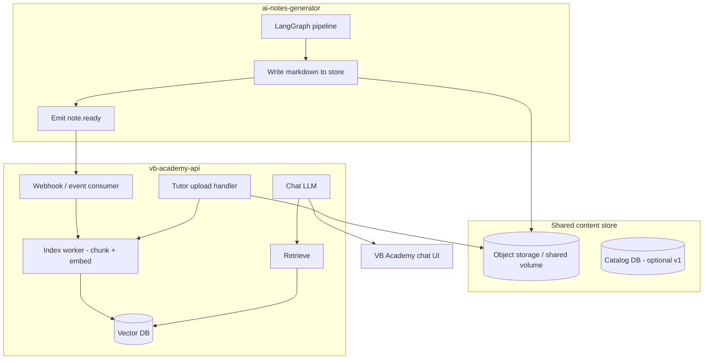
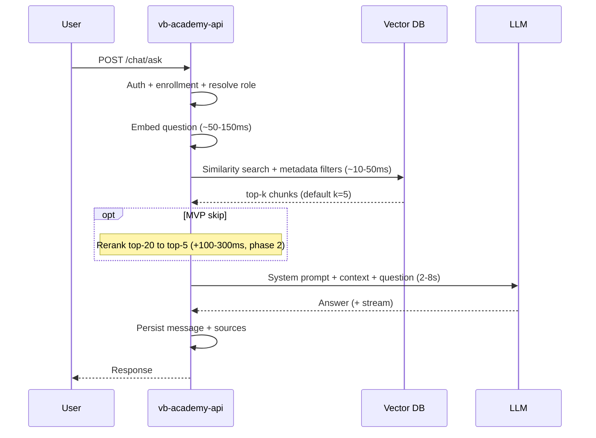

# VB Academy RAG Integration Spec

**Status:** Draft v1.2  
**Date:** 2026-05-23  
**Scope:** Grounded student/tutor chat using generated notes + tutor-uploaded materials  
**Services:** `ai-notes-generator` (content pipeline) · `vb-academy-api` (product + chat + RAG)

---

## 1. Summary

VB Academy needs a chat where answers are **grounded in course materials**:

- **Generated student notes** — primary RAG source (`*_student.md`)
- **Tutor supplements** — structured quiz / assignment / pacing items extracted from tutor guide (not full tutor `.md` embeddings)
- **Tutor uploads** — PDFs, slides, docs uploaded from the VB Academy app

**Decision:** One **shared vector index** with metadata filters. **Embed student markdown only** for lesson content; index **supplements as small tutor-only chunks**. Role (student vs tutor) adjusts the LLM prompt and retrieval filters.

The notes generator writes files, extracts supplements, and emits a `note.ready` event. VB Academy indexes and serves grounded Q&A.

---

## 2. Goals

| Goal | Detail |
|------|--------|
| Grounded answers | LLM answers only from retrieved chunks; refuse when context is insufficient |
| Dual sources | Generated notes + tutor uploads in one searchable index |
| Role-aware | Students see student notes + student-visible uploads; tutors see broader context |
| Low latency | Pre-index all documents; at query time only embed the question + one vector search |
| Clean boundaries | Generator = write pipeline; Academy = read, auth, chat, RAG |

## 3. Non-goals (v1)

- Billing, payments, full LMS features
- Cross-course search without explicit scope
- Generator-hosted chat endpoints
- Re-embedding full documents at query time
- Separate vector indexes merged client-side

---

## 4. System context



### Service ownership

| Concern | ai-notes-generator | vb-academy-api |
|---------|-------------------|----------------|
| Generate notes | ✅ | — |
| Tutor file upload UI | — | ✅ |
| Auth / enrollments | — | ✅ |
| Vector DB | — | ✅ |
| Indexing (embeddings) | Emit event only | ✅ |
| Retrieval at chat time | — | ✅ |
| Chat LLM + streaming | — | ✅ |
| Conversation history | — | ✅ |

---

## 5. Unified vector index

### 5.1 Principle

**One collection** (e.g. `course_chunks`), partitioned by **metadata filters** — not separate indexes for generated vs uploaded content.

### 5.2 Chunk record schema

Each stored vector has:

| Field | Type | Required | Description |
|-------|------|----------|-------------|
| `id` | string (UUID) | ✅ | Unique chunk id |
| `course_id` | string | ✅ | Course identifier |
| `day` | int \| null | ✅ | Lesson day (1–N); `null` = course-wide material |
| `source_type` | enum | ✅ | See §5.3 |
| `visibility` | enum | ✅ | `student` \| `tutor_only` |
| `document_id` | string | ✅ | Stable id for source document (regenerate = new version) |
| `document_version` | int | ✅ | Increment on re-index |
| `filename` | string | ✅ | Original or generated filename |
| `chunk_index` | int | ✅ | Order within document |
| `chunk_text` | string | ✅ | Text stored for citation (also in vector metadata) |
| `heading` | string \| null | | Nearest markdown heading if applicable |
| `session_id` | string \| null | | Generator session id (generated notes only) |
| `indexed_at` | ISO8601 | ✅ | Index timestamp |
| `embedding_model` | string | ✅ | e.g. `nomic-embed-text`, `text-embedding-3-small` |

### 5.3 `source_type` values

| Value | Origin | Default visibility | Embed? |
|-------|--------|-------------------|--------|
| `lesson` | `*_student.md` from generator | `student` | ✅ Yes — chunk + embed |
| `quiz` | `supplements.quizzes[]` in note.ready | `tutor_only` | ✅ Yes — one chunk per item |
| `assignment` | `supplements.assignments[]` | `tutor_only` | ✅ Yes |
| `pacing` | `supplements.pacing[]` | `tutor_only` | ✅ Yes |
| `teaching_tip` | `supplements.teaching_tips[]` | `tutor_only` | ✅ Optional (MVP: yes) |
| `tutor_upload` | PDF/DOC/slides from VB Academy | Configurable | ✅ Yes |

**Do NOT embed** full `*_tutor.md` by default — saves ~50% embedding cost; supplements carry tutor-only retrieval content.

### 5.4 Retrieval filters by role

**Student chat**

```
course_id = :course_id
AND visibility = 'student'
AND source_type IN ('lesson', 'tutor_upload')
AND (day = :day OR :day IS NULL OR day IS NULL)
```

**Tutor chat**

```
course_id = :course_id
AND visibility IN ('student', 'tutor_only')
AND (day = :day OR :day IS NULL OR day IS NULL)
```

Tutor chat gets **lesson chunks + supplement chunks** (quiz answers, homework rubric, pacing). Same index; broader filter.

**LLM role prompt** (same retrieved context, different tone):

- Student: simple explanations, no quiz answers unless in student notes
- Tutor: may reference pacing and assignment rubric from supplement chunks

---

## 6. Ingestion paths

### 6.1 Path A — Generated notes (ai-notes-generator)

**Trigger:** After successful save in `final_response_node` (single lesson) or after each course day completes in `course_runner`.

**Action:** Emit `note.ready` event (webhook or message queue). **Do not block** the generation pipeline on indexing success.

#### Event: `note.ready` (implemented)

```json
{
  "event": "note.ready",
  "event_id": "uuid",
  "occurred_at": "2026-05-23T12:00:00Z",
  "course_id": "course-abc-123",
  "session_id": "sess-456",
  "day": 5,
  "title": "Intro to Transformers",
  "topic": "Transformer architecture basics",
  "course_name": "Full Gen AI Syllabus",
  "student_uri": "/abs/path/to/day-05_..._student.md",
  "tutor_uri": "/abs/path/to/day-05_..._tutor.md",
  "supplements_uri": "/abs/path/to/day-05_..._supplements.json",
  "supplements_item_count": 12,
  "supplements": {
    "visibility": "tutor_only",
    "quizzes": [
      {
        "id": "quiz-01",
        "kind": "rapid_fire",
        "question": "Instagram recommendations?",
        "answer": "Traditional AI",
        "section": "Traditional vs Generative AI"
      }
    ],
    "assignments": [
      {
        "id": "assignment-01",
        "title": "Homework",
        "description": "Explore ChatGPT, Gemini, Claude…",
        "rubric_notes": "Compare response quality, creativity…",
        "section": "Homework"
      }
    ],
    "pacing": [
      {
        "id": "pacing-01",
        "section": "Icebreaker",
        "minutes_marker": "You should be ~20 mins into session",
        "teaching_tip": "TIME CHECK: …"
      }
    ],
    "teaching_tips": [
      {
        "id": "tip-01",
        "section": "What is AI?",
        "tip": "TEACHING NOTE: Start with definition…"
      }
    ]
  },
  "output_root": "generated_notes/full-gen-ai-syllabus/day-05-intro-to-transformers",
  "programming_languages": ["python"],
  "hours_per_day": 1.5,
  "indexing_hint": "Embed student_uri as source_type=lesson visibility=student. Index each supplements.* item as tutor_only."
}
```

| Field | Purpose |
|-------|---------|
| `student_uri` | **Primary RAG** — chunk + embed for all users |
| `supplements` | **Inline structured tutor-only items** — index without parsing tutor `.md` |
| `supplements_uri` | Same JSON on disk — for catch-up if webhook body truncated |
| `tutor_uri` | Human reference / optional fallback; **not embedded by default** |
| `supplements_item_count` | Quick sanity check for index worker |

**Generator implementation:** `services/tutor_supplements_extractor.py` parses tutor markdown at emit time; `services/note_ready_publisher.py` writes `*_supplements.json` and includes inline `supplements` in the webhook.

| Field | Single lesson | Full course day |
|-------|---------------|-----------------|
| `course_id` | null or synthetic | Course id from course store |
| `day` | null or `1` | Day number |
| URIs | Paths under `generated_notes/{topic-slug}/` | Paths under `generated_notes/{course}/day-XX-{title}/` |

**Generator config (proposed env)**

```bash
NOTE_READY_WEBHOOK_URL=https://academy.example.com/internal/events/note-ready
NOTE_READY_WEBHOOK_SECRET=shared-hmac-secret
NOTE_READY_ENABLED=true
```

**Academy handler:** Validate HMAC → read `student_uri` → chunk + embed as `lesson` / `visibility=student` → for each item in `supplements.*` build a small text chunk and embed as `tutor_only` with matching `source_type` → upsert catalog row.

#### VB Academy index worker (pseudocode)

```python
def handle_note_ready(payload: dict):
    doc_id = f"{payload['session_id']}-lesson"
    # 1. Lesson chunks from student markdown
    student_text = read_file(payload["student_uri"])
    for i, chunk in enumerate(chunk_markdown(student_text)):
        upsert_vector(
            text=chunk,
            metadata={
                "course_id": payload["course_id"],
                "day": payload["day"],
                "session_id": payload["session_id"],
                "source_type": "lesson",
                "visibility": "student",
                "document_id": doc_id,
                "chunk_index": i,
                "heading": chunk.heading,
            },
        )

    sup = payload.get("supplements") or load_json(payload.get("supplements_uri"))
    # 2. Quiz chunks (tutor only)
    for q in sup.get("quizzes", []):
        text = f"Quiz ({q['kind']}): {q['question']}"
        if q.get("answer"):
            text += f"\nAnswer: {q['answer']}"
        upsert_vector(
            text=text,
            metadata={
                "course_id": payload["course_id"],
                "day": payload["day"],
                "source_type": "quiz",
                "visibility": "tutor_only",
                "supplement_id": q["id"],
                "section": q.get("section"),
            },
        )

    # 3. Assignments, pacing, teaching_tips — same pattern
    for a in sup.get("assignments", []):
        upsert_vector(
            text=f"Assignment: {a['title']}\n{a['description']}",
            metadata={"source_type": "assignment", "visibility": "tutor_only", ...},
        )
```

**Chunk text for supplements:** Keep each item self-contained (question + answer in one chunk for quizzes) so retrieval returns usable context in one hop.

**Idempotency:** Key on `(document_id, document_version)`. Re-delivery of same event must not duplicate chunks (delete-by-document_id then re-insert, or upsert by chunk id).

---

### 6.2 Path B — Tutor uploads (vb-academy-api)

**Trigger:** Tutor uploads file in VB Academy (PDF, DOCX, PPTX, MD, TXT).

**Flow**

1. Auth: user is tutor for `course_id`
2. Store raw file in object storage
3. Extract text (pdfplumber, python-docx, etc.)
4. Chunk + embed with metadata:
   - `source_type`: `tutor_upload`
   - `visibility`: tutor-selected (`student` | `tutor_only`)
   - `day`: optional lesson association
5. Upsert to same vector collection
6. Return `document_id` to UI

**Re-upload / delete:** Soft-delete or bump `document_version` and remove old chunk ids for that `document_id`.

---

## 7. Chunking strategy

| Content type | Strategy |
|--------------|----------|
| Generated markdown | Split on `##` / `###` headings; target 400–800 tokens; 10–15% overlap |
| Tutor PDF/slides | Page-aware or paragraph split; same token targets |
| Code blocks | Keep fenced blocks intact in one chunk when possible |

Store `heading` in metadata for citations: *"Day 5 — Homework"*.

---

## 8. vb-academy-api endpoints

### 8.1 Internal — event ingestion

```
POST /internal/events/note-ready
Authorization: HMAC or service API key
Body: note.ready payload (§6.1)
Response: 202 Accepted { "index_job_id": "..." }
```

### 8.2 Tutor — uploads

```
POST /courses/{course_id}/materials
Content-Type: multipart/form-data
Body: file, day?, visibility=student|tutor_only
Response: 201 { "document_id", "filename", "chunk_count", "indexed_at" }

DELETE /courses/{course_id}/materials/{document_id}
```

### 8.3 Catalog (optional MVP — can read from vector metadata first)

```
GET /courses/{course_id}/days
GET /courses/{course_id}/days/{day}/notes?role=student|tutor
```

Returns full markdown for UI “view notes” — separate from RAG chunks.

### 8.4 Chat

```
POST /chat/ask
Authorization: Bearer (student or tutor)

Request:
{
  "course_id": "course-abc-123",
  "day": 5,
  "message": "What was the homework?",
  "conversation_id": "conv-uuid",
  "stream": true
}

Response (non-streaming):
{
  "answer": "...",
  "sources": [
    {
      "document_id": "...",
      "source_type": "generated_student",
      "day": 5,
      "filename": "day-05_..._student.md",
      "heading": "Homework",
      "excerpt": "..."
    }
  ],
  "grounded": true,
  "refused": false
}
```

**Streaming:** SSE or WebSocket; same retrieval step, stream LLM tokens.

---

## 9. Chat pipeline (sync path)



### 9.1 Latency budget (target)

| Step | Target |
|------|--------|
| Auth + enrollment | < 20 ms |
| Embed question | 50–150 ms |
| Vector search | 10–50 ms |
| Rerank (optional) | 100–300 ms |
| LLM first token | 500 ms–2 s (stream) |
| **Total to first token** | **< 2.5 s** |

Pre-indexing removes document embedding from the hot path — largest latency win.

### 9.2 Grounding system prompt (template)

```
You are a tutoring assistant for VB Academy.

Rules:
- Answer ONLY using the provided CONTEXT below.
- If the answer is not in CONTEXT, say: "That isn't covered in your course materials yet."
- Do not invent assignments, quiz answers, or facts.
- Cite the day and section when possible.
- Be concise and student-friendly.

CONTEXT:
{retrieved_chunks_with_source_headers}

CONVERSATION (recent):
{last_n_turns}
```

---

## 10. ai-notes-generator changes (minimal)

| Change | Priority | Status | Notes |
|--------|----------|--------|-------|
| Emit `note.ready` webhook after file save | P0 | ✅ Shipped | `services/note_ready_publisher.py` |
| Extract tutor supplements (quiz, homework, pacing) | P0 | ✅ Shipped | `services/tutor_supplements_extractor.py` |
| Write `*_supplements.json` + inline in event | P0 | ✅ Shipped | Included in webhook payload |
| SQLite outbox + background retry when Academy down | P0 | ✅ Shipped | `utils/note_event_outbox.py` |
| Catch-up API for Academy | P0 | ✅ Shipped | `GET /internal/note-events/pending` |
| Shared volume / S3 upload (production) | P1 | ⬜ | Academy reads same objects |

**Generator must NOT:** run chat LLM, own vector DB, or handle tutor uploads.

### 10.1 Reliability — VB Academy down

| Behavior | Implementation |
|----------|----------------|
| Notes always saved first | `final_response_node` saves files before `publish_note_ready` |
| Webhook failure never fails generation | `publish_note_ready` catches all errors |
| Failed events queued | SQLite outbox (`NOTE_READY_OUTBOX_DB_PATH`) |
| Automatic retry | Background worker every `NOTE_READY_RETRY_INTERVAL_SEC` (default 300s) with exponential backoff |
| Academy catch-up on startup | Poll `GET /internal/note-events/pending` (API key required) |
| Dead letter | After `NOTE_READY_MAX_ATTEMPTS` (default 20), status → `dead` |
| Observability | `GET /health` → `note_ready_enabled`, `note_ready_pending` |

**Env vars:** see `.env.example` — `NOTE_READY_ENABLED`, `NOTE_READY_WEBHOOK_URL`, `NOTE_READY_WEBHOOK_SECRET`, etc.

---

## 11. vb-academy-api components (new)

| Component | Responsibility |
|-----------|----------------|
| `EventConsumer` | Receive `note.ready`, enqueue index job |
| `IndexWorker` | Chunk, embed, upsert; shared by events + uploads |
| `EmbeddingClient` | Ollama local embed or OpenAI/Groq embed API |
| `VectorStore` | Chroma (MVP) or pgvector (production) |
| `RetrievalService` | Embed query + filter + top-k |
| `ChatService` | Retrieve → prompt → LLM → persist |
| `MaterialsService` | Tutor upload CRUD |

---

## 12. Storage layout

### MVP (local dev)

```
shared/
  generated_notes/          # Generator writes; Academy reads
  academy.db                  # Catalog, conversations, enrollments
  chroma/                     # Vector index
```

### Production

| Store | Technology |
|-------|------------|
| Raw files | S3 / GCS |
| Catalog + chat history | Postgres |
| Vectors | pgvector extension or managed vector DB |
| Events | Webhook + retry queue (Redis/SQS) |

---

## 13. Security

| Rule | Implementation |
|------|----------------|
| Webhook authenticity | HMAC-SHA256 on `note.ready` body |
| Student isolation | Filter by `course_id` + enrollment; never return `tutor_only` chunks |
| Tutor uploads | Virus scan (phase 2); size limits; allowed MIME types |
| PII in chunks | No logging of full chunk text in production logs |
| API auth | JWT for chat; service key for internal events |

---

## 14. MVP phases

### Phase 0 — Prove grounding (no vector DB)

- Academy `GET` reads markdown file path from catalog
- Full-doc context for one `course_id` + `day`
- `POST /chat/ask` with strict prompt

### Phase 1 — Unified index

- `note.ready` webhook from generator
- Chroma + local embeddings
- Tutor upload → same index
- Student chat with retrieval + citations

### Phase 2 — Production hardening

- pgvector, S3, webhook retries
- Reranker, conversation memory
- Regenerate notes → version bump + re-index
- Metrics: retrieval latency, refusal rate, citation rate

---

## 15. Acceptance criteria

| # | Criterion |
|---|-----------|
| AC-1 | Student question returns answer grounded in `lesson` chunks only |
| AC-2 | Tutor question can retrieve quiz answers from `quiz` supplement chunks |
| AC-3 | Tutor uploads appear in search within 60 s of upload |
| AC-4 | New generated day indexed within 60 s of `note.ready` |
| AC-5 | Question outside context returns refusal, not hallucination |
| AC-6 | Student never receives chunks with `visibility=tutor_only` |
| AC-7 | Duplicate `note.ready` events do not duplicate searchable chunks |
| AC-8 | Full tutor `.md` is not embedded; supplements cover tutor-only retrieval |

---

## 17. VB Academy implementation checklist

Use this when building the Academy app:

1. **Webhook receiver** — `POST /internal/events/note-ready`
   - Verify `X-Note-Ready-Signature` HMAC if secret shared
   - Return `202 Accepted` immediately; index async

2. **On startup catch-up** — `GET http://generator:8000/internal/note-events/pending` with `X-API-Key`
   - Process any missed events while Academy was down

3. **Index worker**
   - Read `student_uri` → chunk → embed → `source_type=lesson`, `visibility=student`
   - Loop `supplements.quizzes|assignments|pacing|teaching_tips` → small chunks → `visibility=tutor_only`
   - Skip embedding `tutor_uri` unless debugging

4. **Chat API** — `POST /chat/ask { course_id, day, message, role }`
   - Student: filter `visibility=student`
   - Tutor: filter `visibility IN (student, tutor_only)`
   - Different system prompt per role; same vector index

5. **Tutor file uploads** — same index, `source_type=tutor_upload`

6. **Idempotency** — key vectors on `(session_id, source_type, supplement_id | chunk_index)`

---

## 18. Open questions

| # | Question | Default assumption |
|---|----------|------------------|
| OQ-1 | Embedding model (local Ollama vs API)? | Ollama `nomic-embed-text` for dev |
| OQ-2 | Default `day` scope in chat UI — current lesson vs whole course? | Current day; “search full course” toggle in phase 2 |
| OQ-3 | Include tutor notes in tutor chat retrieval always? | Yes |
| OQ-4 | Generator uploads to S3 or shared mount first? | Shared mount MVP; S3 for prod |

---

## 19. Related docs

| Document | Location |
|----------|----------|
| Notes generator README | `README.md` |
| Notes generator README | `README.md` |
| Supplements extractor | `services/tutor_supplements_extractor.py` |
| note.ready publisher | `services/note_ready_publisher.py` |
| Production prompt profiles | `team_logs/production_backlog.md` |

---

## 20. Revision history

| Version | Date | Author | Changes |
|---------|------|--------|---------|
| 1.2 | 2026-05-23 | Backend | Student-only embeddings + inline tutor supplements in note.ready |
| 1.1 | 2026-05-23 | Backend | note.ready webhook, outbox, retry worker, catch-up API |
| 1.0 | 2026-05-23 | Architecture discussion | Initial spec |
