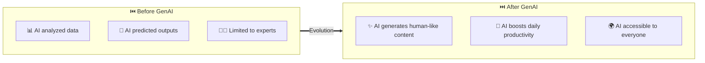

# 🤖 Day 1 — Introduction to Generative AI

> **Course:** Generative AI Fundamentals | **Session:** 01 | **Level:** Beginner → Intermediate

---

## 📋 What You Will Learn Today

By the end of this session, you should understand:

| # | Topic |
|---|-------|
| 1 | ✅ What Artificial Intelligence (AI) is |
| 2 | ✅ Difference between ML, DL and Generative AI |
| 3 | ✅ Traditional AI vs Generative AI |
| 4 | ✅ Real-world applications of Generative AI |
| 5 | ✅ High-level understanding of how ChatGPT works |
| 6 | ✅ Why Generative AI became revolutionary |

---

## 1. 🧠 What is Artificial Intelligence (AI)?

### 📖 Definition

> **Artificial Intelligence (AI)** is the ability of machines to **mimic human intelligence**.
>
> *In simple words: AI enables computers to perform tasks that normally require human intelligence.*

---

### 🌍 Examples of AI Around Us

| Application | How AI is Used |
|---|---|
| 🔓 **Face Unlock** | Detects and recognizes faces |
| 📺 **YouTube Recommendations** | Suggests videos based on behavior |
| 🗺️ **Google Maps** | Predicts traffic and best routes |
| 🎙️ **Alexa / Siri** | Understands voice commands |
| 📧 **Spam Detection** | Detects unwanted emails |

---

### 🏗️ AI Hierarchy

```mermaid
graph TD
 A["🌐 Artificial Intelligence — Broad field of making — machines intelligent"]
 B["📊 Machine Learning — Systems that learn — patterns from data"]
 C["🧬 Deep Learning — Neural networks for — complex tasks"]
 D["✨ Generative AI — Creates new content: — text, images, code"]

 A --> B
 B --> C
 C --> D

 style A fill:#1a1a2e,stroke:#7c3aed,color:#e2e8f0,stroke-width:3px
 style B fill:#16213e,stroke:#2563eb,color:#e2e8f0,stroke-width:3px
 style C fill:#0f3460,stroke:#06b6d4,color:#e2e8f0,stroke-width:3px
 style D fill:#4c1d95,stroke:#d946ef,color:#e2e8f0,stroke-width:3px```

#### 🔑 Understanding the Hierarchy

- 🌐 **AI** is the **biggest** field — the umbrella concept
- 📊 **ML** is a **subset** of AI
- 🧬 **DL** is a **subset** of ML
- ✨ **Generative AI** is a **subset** of DL

---

## 2. 📊 Machine Learning vs Deep Learning vs Generative AI

### 🔵 Machine Learning (ML)

> Machine Learning allows systems to **learn patterns from data** automatically.

#### 🏠 Classic Example — House Price Prediction

```mermaid
flowchart LR
 A["📥 Input Features — 📐 Area — 📍 Location — 🛏️ Bedrooms"]
 B["🤖 ML Model — Learns from — historical data"]
 C["💰 Output — Estimated — House Price"]

 A --> B --> C

 style A fill:#1e3a5f,stroke:#2563eb,color:#e2e8f0,stroke-width:2px
 style B fill:#1e3a5f,stroke:#7c3aed,color:#e2e8f0,stroke-width:2px
 style C fill:#1e3a5f,stroke:#10b981,color:#e2e8f0,stroke-width:2px```

#### 🎯 ML Key Focus Areas

```mermaid
graph TD
 ML["🤖 Machine Learning — Key Focus Areas"]
 P["📈 Prediction"]
 C["🎯 Classification"]
 R["⭐ Recommendation"]

 P1["Stock prices"]
 P2["Weather forecasting"]
 P3["House prices"]

 C1["Spam detection"]
 C2["Disease diagnosis"]
 C3["Sentiment analysis"]

 R1["Netflix movies"]
 R2["Amazon products"]
 R3["YouTube videos"]

 ML --> P
 ML --> C
 ML --> R

 P --> P1
 P --> P2
 P --> P3

 C --> C1
 C --> C2
 C --> C3

 R --> R1
 R --> R2
 R --> R3

 style ML fill:#312e81,stroke:#7c3aed,color:#e2e8f0,stroke-width:3px
 style P fill:#1e3a5f,stroke:#2563eb,color:#e2e8f0,stroke-width:2px
 style C fill:#1e3a5f,stroke:#10b981,color:#e2e8f0,stroke-width:2px
 style R fill:#1e3a5f,stroke:#f59e0b,color:#e2e8f0,stroke-width:2px```

---

### 🟣 Deep Learning (DL)

> Deep Learning uses **neural networks** with multiple layers to process complex data.

#### 🧬 What Deep Learning Powers

```mermaid
graph LR
 DL["🧬 Deep Learning"]
 A["🖼️ Images — Face Recognition — Object Detection"]
 B["🔊 Audio — Speech Recognition — Voice Assistants"]
 C["🎬 Video — Self-driving Cars — Action Recognition"]
 D["💬 Language — Translation — NLP Tasks"]

 DL --> A
 DL --> B
 DL --> C
 DL --> D

 style DL fill:#312e81,stroke:#7c3aed,color:#e2e8f0,stroke-width:3px
 style A fill:#1e3a5f,stroke:#2563eb,color:#e2e8f0,stroke-width:2px
 style B fill:#1e3a5f,stroke:#06b6d4,color:#e2e8f0,stroke-width:2px
 style C fill:#1e3a5f,stroke:#10b981,color:#e2e8f0,stroke-width:2px
 style D fill:#1e3a5f,stroke:#f59e0b,color:#e2e8f0,stroke-width:2px```

---

### 🟡 Generative AI

> Generative AI **creates NEW content** — it doesn't just analyze, it generates!

#### 🛠️ Generative AI Tools

| Tool | Purpose | Category |
|---|---|---|
| 💬 **ChatGPT** | Text generation, Q&A | Language |
| 💻 **GitHub Copilot** | Code generation | Code |
| 🎨 **Midjourney** | Image generation | Visual |
| 🎵 **Suno** | Music generation | Audio |
| 🎬 **Runway** | Video generation | Video |

---

### ⚡ Critical Difference: Traditional AI vs Generative AI

```mermaid
graph LR
 subgraph Traditional["🔵 Traditional AI"]
 direction TB
 T1["✓ Predicts outcomes"]
 T2["✓ Detects spam"]
 T3["✓ Recommends products"]
 T4["✓ Fixed outputs"]
 end

 subgraph GenAI["🟡 Generative AI"]
 direction TB
 G1["✨ Creates new content"]
 G2["✨ Writes emails"]
 G3["✨ Generates images"]
 G4["✨ Dynamic outputs"]
 end

 Traditional ==>|"Evolution"| GenAI
```

| Capability | Traditional AI | Generative AI |
|---|---|---|
| **Core Action** | Predicts | ✨ Creates |
| **Email** | Detects spam | ✨ Writes emails |
| **Commerce** | Recommends products | ✨ Generates ad images |
| **Output Type** | Fixed outputs | ✨ Dynamic outputs |

---

## 3. 🔄 Traditional AI vs Generative AI — Process Flows

### 🔵 Traditional AI Flow

```mermaid
flowchart TD
 A["📥 Input Data — Customer transactions"]
 B["🤖 AI Model — Fraud Detection System"]
 C{"🔍 Decision"}
 D["🚨 FRAUD — Block transaction"]
 E["✅ LEGITIMATE — Allow transaction"]

 A --> B --> C
 C -->|Yes| D
 C -->|No| E

 style A fill:#1e3a5f,stroke:#2563eb,color:#e2e8f0,stroke-width:2px
 style B fill:#1e3a5f,stroke:#7c3aed,color:#e2e8f0,stroke-width:2px
 style C fill:#1e3a5f,stroke:#f59e0b,color:#e2e8f0,stroke-width:2px
 style D fill:#1a1a2e,stroke:#f59e0b,color:#e2e8f0,stroke-width:2px
 style E fill:#0f3460,stroke:#10b981,color:#e2e8f0,stroke-width:2px```

### 🟡 Generative AI Flow

```mermaid
flowchart TD
 A["💬 User Prompt — 'Write a resignation email'"]
 B["🧠 LLM / GenAI Model — ChatGPT, Gemini, Claude"]
 C["⚙️ Context Processing — Understands intent & context"]
 D["✨ New Content Generated — Professional resignation email — with proper format & tone"]

 A --> B --> C --> D

 style A fill:#312e81,stroke:#7c3aed,color:#e2e8f0,stroke-width:2px
 style B fill:#4c1d95,stroke:#d946ef,color:#e2e8f0,stroke-width:2px
 style C fill:#312e81,stroke:#7c3aed,color:#e2e8f0,stroke-width:2px
 style D fill:#0f3460,stroke:#10b981,color:#e2e8f0,stroke-width:2px```

---

### 🆚 Side-by-Side Comparison

```mermaid
graph LR
 subgraph Instagram["📸 Instagram - Traditional AI"]
 I1["User Behavior — Data"] --> I2["Recommendation — Model"] --> I3["Suggested — Reels"]
 end

 subgraph ChatGPT_Flow["💬 ChatGPT - Generative AI"]
 C1["User — Prompt"] --> C2["LLM — Model"] --> C3["Generated — Content"]
 end
```

---

## 4. 🌍 Why Generative AI Became So Popular



> 💡 **Industry Statement:**
> *"Developers using AI are becoming more productive than developers not using AI."*

---

## 5. 🏭 Real-World Applications of Generative AI

```mermaid
graph TD
 Root["✨ Generative AI — Applications"]

 SE["💻 Software — Engineering"]
 HC["🏥 Healthcare"]
 BK["🏦 Banking"]
 ED["🎓 Education"]
 MK["📣 Marketing"]

 SE1["AI Code Generation"]
 SE2["AI Debugging"]
 SE3["AI Documentation"]

 HC1["Medical Report — Summarization"]
 HC2["Drug Discovery"]
 HC3["AI Doctor — Assistants"]

 BK1["AI Customer — Support"]
 BK2["Fraud Analysis"]
 BK3["Document — Summarization"]

 ED1["AI Tutors"]
 ED2["Notes Generation"]
 ED3["Personalized — Learning"]

 MK1["Ad Copy — Generation"]
 MK2["SEO Content"]
 MK3["Social Media — Content"]

 Root --> SE
 Root --> HC
 Root --> BK
 Root --> ED
 Root --> MK

 SE --> SE1
 SE --> SE2
 SE --> SE3

 HC --> HC1
 HC --> HC2
 HC --> HC3

 BK --> BK1
 BK --> BK2
 BK --> BK3

 ED --> ED1
 ED --> ED2
 ED --> ED3

 MK --> MK1
 MK --> MK2
 MK --> MK3

 style Root fill:#4c1d95,stroke:#d946ef,color:#e2e8f0,stroke-width:4px
 style SE fill:#312e81,stroke:#7c3aed,color:#e2e8f0,stroke-width:2px
 style HC fill:#312e81,stroke:#10b981,color:#e2e8f0,stroke-width:2px
 style BK fill:#312e81,stroke:#2563eb,color:#e2e8f0,stroke-width:2px
 style ED fill:#312e81,stroke:#f59e0b,color:#e2e8f0,stroke-width:2px
 style MK fill:#312e81,stroke:#ec4899,color:#e2e8f0,stroke-width:2px```

| Industry | Applications |
|---|---|
| 💻 **Software Engineering** | Code generation, Debugging, Documentation |
| 🏥 **Healthcare** | Medical summarization, Drug discovery, AI assistants |
| 🏦 **Banking** | Customer support, Fraud analysis, Document summary |
| 🎓 **Education** | AI tutors, Notes generation, Personalized learning |
| 📣 **Marketing** | Ad copy, SEO content, Social media posts |

---

## 6. ⚙️ How ChatGPT Works (High-Level)

### 🏗️ ChatGPT Architecture Flow

```mermaid
flowchart TD
 A["👤 User Prompt — 'Explain Quantum Computing'"]
 B["🔤 Tokenization — Breaking text into tokens — 'Explain' → 'Quantum' → 'Computing'"]
 C["🧠 LLM Processing — Transformer Architecture — Attention Mechanisms — Contextual Understanding"]
 D["📊 Token Probability — Calculates probability for — each possible next token"]
 E["✍️ Token-by-Token Generation — Generates response — one token at a time"]
 F["📤 Final Response — Complete, coherent answer — returned to user"]

 A --> B --> C --> D --> E --> F

 style A fill:#1e3a5f,stroke:#2563eb,color:#e2e8f0,stroke-width:2px
 style B fill:#312e81,stroke:#7c3aed,color:#e2e8f0,stroke-width:2px
 style C fill:#4c1d95,stroke:#d946ef,color:#e2e8f0,stroke-width:2px
 style D fill:#312e81,stroke:#f59e0b,color:#e2e8f0,stroke-width:2px
 style E fill:#1e3a5f,stroke:#10b981,color:#e2e8f0,stroke-width:2px
 style F fill:#0f3460,stroke:#10b981,color:#e2e8f0,stroke-width:2px```

---

### 📚 Step 1 — Training on Large Data

ChatGPT is trained using **massive amounts of text data**:

```mermaid
graph TD
 Title["📚 ChatGPT Training Data Sources"]

 D1["🌐 Web Pages & Articles — 40%"]
 D2["📖 Books & Literature — 25%"]
 D3["💻 Code & Documentation — 20%"]
 D4["🎓 Academic Papers — 10%"]
 D5["📦 Other Sources — 5%"]

 Title --> D1
 Title --> D2
 Title --> D3
 Title --> D4
 Title --> D5

 style Title fill:#4c1d95,stroke:#d946ef,color:#e2e8f0,stroke-width:3px
 style D1 fill:#1e3a5f,stroke:#2563eb,color:#e2e8f0,stroke-width:2px
 style D2 fill:#1e3a5f,stroke:#7c3aed,color:#e2e8f0,stroke-width:2px
 style D3 fill:#1e3a5f,stroke:#10b981,color:#e2e8f0,stroke-width:2px
 style D4 fill:#1e3a5f,stroke:#f59e0b,color:#e2e8f0,stroke-width:2px
 style D5 fill:#1e3a5f,stroke:#06b6d4,color:#e2e8f0,stroke-width:2px```

---

### 🔮 Step 2 — Learning Language Patterns

```mermaid
flowchart LR
 A["📝 Input — 'I am going to drink...'"]
 B["🧠 LLM analyzes — context & patterns"]
 C["📊 Probability — Scores"]
 D["💧 water — 45%"]
 E["☕ coffee — 30%"]
 F["🍵 tea — 20%"]
 G["🥤 juice — 5%"]
 H["✅ Most Probable — Token Selected"]

 A --> B --> C
 C --> D
 C --> E
 C --> F
 C --> G
 D --> H

 style A fill:#1e3a5f,stroke:#2563eb,color:#e2e8f0,stroke-width:2px
 style B fill:#312e81,stroke:#7c3aed,color:#e2e8f0,stroke-width:2px
 style C fill:#1e3a5f,stroke:#f59e0b,color:#e2e8f0,stroke-width:2px
 style D fill:#1e3a5f,stroke:#06b6d4,color:#e2e8f0,stroke-width:2px
 style E fill:#1e3a5f,stroke:#06b6d4,color:#e2e8f0,stroke-width:2px
 style F fill:#1e3a5f,stroke:#06b6d4,color:#e2e8f0,stroke-width:2px
 style G fill:#1e3a5f,stroke:#06b6d4,color:#e2e8f0,stroke-width:2px
 style H fill:#0f3460,stroke:#10b981,color:#e2e8f0,stroke-width:2px```

> 🔑 **Key Insight:**
> *Large Language Models (LLMs) are advanced **next-word prediction** systems.*

---

### 🎯 Step 3 — Token Prediction Example

```mermaid
flowchart TD
 A["📥 Input: 'India is famous for'"]
 B["🧠 LLM Processing"]
 C1["🏏 cricket — High probability"]
 C2["🎭 culture — High probability"]
 C3["🍛 food — Medium probability"]
 C4["🎉 festivals — Medium probability"]
 D["📤 Generated Response — 'India is famous for its rich culture, — cricket, diverse food, and colorful festivals.'"]

 A --> B
 B --> C1
 B --> C2
 B --> C3
 B --> C4
 C1 & C2 & C3 & C4 --> D

 style A fill:#1e3a5f,stroke:#2563eb,color:#e2e8f0,stroke-width:2px
 style B fill:#4c1d95,stroke:#d946ef,color:#e2e8f0,stroke-width:2px
 style C1 fill:#312e81,stroke:#7c3aed,color:#e2e8f0,stroke-width:2px
 style C2 fill:#312e81,stroke:#7c3aed,color:#e2e8f0,stroke-width:2px
 style C3 fill:#312e81,stroke:#7c3aed,color:#e2e8f0,stroke-width:2px
 style C4 fill:#312e81,stroke:#7c3aed,color:#e2e8f0,stroke-width:2px
 style D fill:#0f3460,stroke:#10b981,color:#e2e8f0,stroke-width:2px```

> ⚠️ **Important Clarification:**
> *ChatGPT does **NOT** think like humans.*
> *It **predicts patterns intelligently** using training data.*

---

## 7. 📈 Industry Evolution & Demand

### 🚀 Technology Era Evolution

```mermaid
graph LR
 A["🌐 Web Dev Era — HTML, CSS, JS"]
 B["📱 Mobile App Era — iOS, Android"]
 C["☁️ Cloud Era — AWS, Azure, GCP"]
 D["🤖 AI & GenAI Era — LLMs, RAG, Agents"]

 A --> B --> C --> D

 style A fill:#1e3a5f,stroke:#2563eb,color:#e2e8f0,stroke-width:2px
 style B fill:#1e3a5f,stroke:#10b981,color:#e2e8f0,stroke-width:2px
 style C fill:#312e81,stroke:#7c3aed,color:#e2e8f0,stroke-width:2px
 style D fill:#4c1d95,stroke:#d946ef,color:#e2e8f0,stroke-width:4px```

### 💼 High-Demand AI Roles

```mermaid
graph TD
 Market["🚀 AI Job Market — High-Demand Roles"]

 R1["🤖 AI Engineer"]
 R2["✨ GenAI Engineer"]
 R3["📚 RAG Engineer"]
 R4["📱 AI App Developer"]
 R5["🔄 Agentic AI Engineer"]

 R1A["Build AI-powered apps"]
 R1B["LLM integration"]

 R2A["Prompt engineering"]
 R2B["Model fine-tuning"]

 R3A["Vector databases"]
 R3B["Retrieval systems"]

 R4A["End-to-end AI apps"]
 R4B["APIs & deployment"]

 R5A["Multi-agent systems"]
 R5B["AutoGen & LangGraph"]

 Market --> R1
 Market --> R2
 Market --> R3
 Market --> R4
 Market --> R5

 R1 --> R1A
 R1 --> R1B

 R2 --> R2A
 R2 --> R2B

 R3 --> R3A
 R3 --> R3B

 R4 --> R4A
 R4 --> R4B

 R5 --> R5A
 R5 --> R5B

 style Market fill:#4c1d95,stroke:#d946ef,color:#e2e8f0,stroke-width:4px
 style R1 fill:#312e81,stroke:#7c3aed,color:#e2e8f0,stroke-width:2px
 style R2 fill:#312e81,stroke:#d946ef,color:#e2e8f0,stroke-width:2px
 style R3 fill:#312e81,stroke:#2563eb,color:#e2e8f0,stroke-width:2px
 style R4 fill:#312e81,stroke:#10b981,color:#e2e8f0,stroke-width:2px
 style R5 fill:#312e81,stroke:#f59e0b,color:#e2e8f0,stroke-width:2px```

---

## 8. 🔍 Introduction to RAG — Preview

### 📡 Basic RAG Architecture

```mermaid
flowchart TD
 A["👤 User Question — 'What is our refund policy?'"]
 B["🔍 Retrieve Relevant Documents — Search company knowledge base — using Vector Similarity"]
 C["📄 Retrieved Context — Relevant policy documents found"]
 D["🧠 Send Context + Question to LLM — 'Based on this context, answer...'"]
 E["✨ Generate Accurate Response — Grounded in company data"]

 A --> B --> C --> D --> E

 style A fill:#1e3a5f,stroke:#2563eb,color:#e2e8f0,stroke-width:2px
 style B fill:#312e81,stroke:#7c3aed,color:#e2e8f0,stroke-width:2px
 style C fill:#1e3a5f,stroke:#f59e0b,color:#e2e8f0,stroke-width:2px
 style D fill:#4c1d95,stroke:#d946ef,color:#e2e8f0,stroke-width:2px
 style E fill:#0f3460,stroke:#10b981,color:#e2e8f0,stroke-width:2px```

> 💡 **Why RAG?**
> Companies usually cannot train their own ChatGPT models from scratch.
> Instead, they **connect company data to existing LLMs**.
> This concept is called **RAG (Retrieval Augmented Generation)**.
> → *Will be covered in depth in upcoming sessions.*

---

## 📝 Key Takeaways

> After today's session, remember these points:

```mermaid
graph TD
 KT["🎯 Day 1 — Key Takeaways"]
 K1["🌐 AI is a broad field — of intelligence"]
 K2["📊 ML learns patterns — from data"]
 K3["🧬 DL uses — neural networks"]
 K4["✨ GenAI creates — new content"]
 K5["🔄 ChatGPT uses — pattern prediction"]
 K6["🔤 LLMs generate text — token by token"]
 K7["🚀 GenAI is transforming — all industries"]

 KT --> K1
 KT --> K2
 KT --> K3
 KT --> K4
 KT --> K5
 KT --> K6
 KT --> K7

 style KT fill:#4c1d95,stroke:#d946ef,color:#e2e8f0,stroke-width:4px
 style K1 fill:#1e3a5f,stroke:#2563eb,color:#e2e8f0,stroke-width:2px
 style K2 fill:#1e3a5f,stroke:#2563eb,color:#e2e8f0,stroke-width:2px
 style K3 fill:#1e3a5f,stroke:#2563eb,color:#e2e8f0,stroke-width:2px
 style K4 fill:#1e3a5f,stroke:#2563eb,color:#e2e8f0,stroke-width:2px
 style K5 fill:#1e3a5f,stroke:#2563eb,color:#e2e8f0,stroke-width:2px
 style K6 fill:#1e3a5f,stroke:#2563eb,color:#e2e8f0,stroke-width:2px
 style K7 fill:#1e3a5f,stroke:#2563eb,color:#e2e8f0,stroke-width:2px```

---

## ❓ Quick Revision Questions

| # | Question |
|---|---|
| 1️⃣ | What is Artificial Intelligence? |
| 2️⃣ | Difference between ML and Generative AI? |
| 3️⃣ | Why is ChatGPT called Generative AI? |
| 4️⃣ | Give one real-world application of GenAI. |
| 5️⃣ | What is the basic idea behind LLMs? |

---

## 🏠 Homework

### Explore & Compare these AI Tools

| Tool | Website |
|---|---|
| 💬 **ChatGPT** | chat.openai.com |
| 🌟 **Google Gemini** | gemini.google.com |
| 🧠 **Claude AI** | claude.ai |

### Compare Across These Dimensions

- [ ] 📖 **Response Quality** — Which gives more accurate answers?
- [ ] 🎨 **Creativity** — Which generates more creative content?
- [ ] 💻 **Coding Capability** — Which writes better code?
- [ ] ⚡ **Speed** — Which responds fastest?

---

## 🔭 Next Class Preview

### 📅 Day 2 — Tokens and Tokenization

```mermaid
graph LR
 A["🔤 What is — a Token?"]
 B["✂️ Tokenization — Process"]
 C["📏 Context — Window"]
 D["⚠️ Token — Limits"]
 E["💡 Why Tokenization — Matters in LLMs"]

 A --> B --> C --> D --> E

 style A fill:#1e3a5f,stroke:#2563eb,color:#e2e8f0,stroke-width:2px
 style B fill:#1e3a5f,stroke:#7c3aed,color:#e2e8f0,stroke-width:2px
 style C fill:#312e81,stroke:#06b6d4,color:#e2e8f0,stroke-width:2px
 style D fill:#312e81,stroke:#f59e0b,color:#e2e8f0,stroke-width:2px
 style E fill:#4c1d95,stroke:#d946ef,color:#e2e8f0,stroke-width:2px```

> 🎉 **Great work completing Day 1!** See you in the next session.

---

