# 🤖 Day 1 — Introduction to Generative AI
## 👨‍🏫 Teacher's Annotated Guide

> **Course:** Generative AI Fundamentals | **Session:** 01 | **Level:** Beginner → Intermediate

> **📌 For Teachers:** This is the student content WITH inline teaching notes. Project the clean student PDF to class while referring to this annotated version.

---

🎯 <b>TEACHING PREP - Click to Expand</b>

### Session Overview
- **Duration:** 1.5-2 hours (recommended: 1 hr 40 mins)
- **Style:** Highly interactive, question-driven
- **Goal:** Build excitement, NOT technical depth

### Critical Success Factors
✅ Ask questions every 5-10 minutes  
✅ Use real-world analogies  
✅ Make students answer, don't lecture  
✅ Keep energy HIGH  

### Before You Start
- [ ] Review all sections once
- [ ] Test all diagrams render properly
- [ ] Prepare board/whiteboard for drawing
- [ ] Have ChatGPT/Gemini ready for live demos (optional)
- [ ] Know your examples from students' domains

---

## 🎤 START WITH ICEBREAKER (10 mins)

> **👨‍🏫 TEACHING NOTE:**  
> **DO NOT** start with definitions. Build rapport first.
> 
> **Ask:**
> - "How many used ChatGPT before?"
> - "What did you use it for?" (Resume? Code? Assignments?)
> 
> **Then deliver the hook:**  
> *"Most people know HOW to use ChatGPT. But few understand HOW it works. By the end of this course, you'll understand how ChatGPT, Claude, and AI agents are BUILT."*
> 
> **Time:** 10 mins | **Energy:** HIGH

---

## 📋 What You Will Learn Today

By the end of this session, you should understand:

| # | Topic |
|---|-------|
| 1 | ✅ What Artificial Intelligence (AI) is |
| 2 | ✅ Difference between ML, DL and Generative AI |
| 3 | ✅ Traditional AI vs Generative AI |
| 4 | ✅ Real-world applications of Generative AI |
| 5 | ✅ High-level understanding of how ChatGPT works |
| 6 | ✅ Why Generative AI became revolutionary |

---

## 1. 🧠 What is Artificial Intelligence (AI)?

> **👨‍🏫 TEACHING STRATEGY:**  
> - Start with the definition
> - Immediately connect to THEIR daily experiences
> - Draw the hierarchy diagram on board as you explain
> - **Key phrase:** "AI enables computers to mimic human intelligence"
> 
> **Time for this section:** 10 mins

### 📖 Definition

> **Artificial Intelligence (AI)** is the ability of machines to **mimic human intelligence**.
>
> *In simple words: AI enables computers to perform tasks that normally require human intelligence.*

> **👨‍🏫 TEACHING TIP:**  
> After the definition, immediately ask: "What are examples of AI you use daily?"  
> Let students answer. Write their responses on board. Then show the table below.

---

### 🌍 Examples of AI Around Us

| Application | How AI is Used |
|---|---|
| 🔓 **Face Unlock** | Detects and recognizes faces |
| 📺 **YouTube Recommendations** | Suggests videos based on behavior |
| 🗺️ **Google Maps** | Predicts traffic and best routes |
| 🎙️ **Alexa / Siri** | Understands voice commands |
| 📧 **Spam Detection** | Detects unwanted emails |

> **👨‍🏫 INTERACTIVE MOMENT:**  
> **Ask:** "How does YouTube know what videos you like?"  
> Students will say: "history, behavior, watch time"  
> **Then say:** "Exactly! That pattern-learning capability is AI."

---

### 🏗️ AI Hierarchy

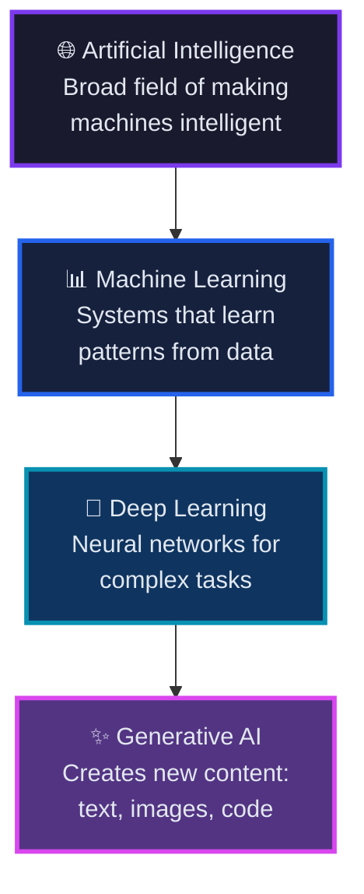

> **👨‍🏫 CRITICAL DIAGRAM:**  
> This is THE MOST important diagram of the course.  
> - Draw it on the board as Russian nesting dolls
> - Emphasize: Each is a SUBSET of the one above
> - **Repeat:** "AI → ML → DL → GenAI"
> - Ask students to draw it in their notes

#### 🔑 Understanding the Hierarchy

- 🌐 **AI** is the **biggest** field — the umbrella concept
- 📊 **ML** is a **subset** of AI
- 🧬 **DL** is a **subset** of ML
- ✨ **Generative AI** is a **subset** of DL

> **👨‍🏫 TIME CHECK:** You should be ~20 mins into session

---

## 2. 📊 Machine Learning vs Deep Learning vs Generative AI

> **👨‍🏫 TEACHING STRATEGY:**  
> This is where students get MOST interested.  
> - Use concrete examples for each
> - For GenAI, build to the "Aha!" moment
> - **Time:** 15 mins

### 🔵 Machine Learning (ML)

> Machine Learning allows systems to **learn patterns from data** automatically.

> **👨‍🏫 SAY THIS:**  
> "Suppose you want to predict house prices. You give the machine historical data: area, location, bedrooms, and their prices. The machine LEARNS the pattern. Then it can predict new house prices. That's ML."

#### 🏠 Classic Example — House Price Prediction

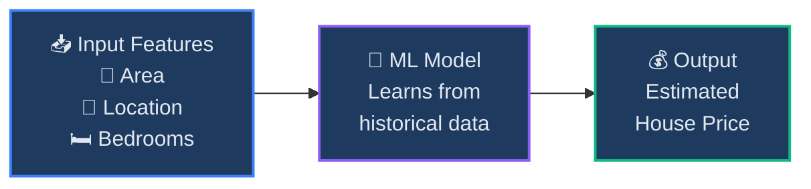

#### 🎯 ML Key Focus Areas

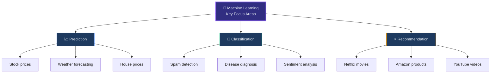

> **👨‍🏫 QUICK CHECK:**  
> Ask: "Is Netflix recommendation ML?" (Yes!)  
> Ask: "Is weather forecasting ML?" (Yes!)

---

### 🟣 Deep Learning (DL)

> Deep Learning uses **neural networks** with multiple layers to process complex data.

> **👨‍🏫 SIMPLE ANALOGY:**  
> "ML is like a small brain. DL is like a BIG neural network brain. We use DL for complex things like images, audio, video, and language."

#### 🧬 What Deep Learning Powers

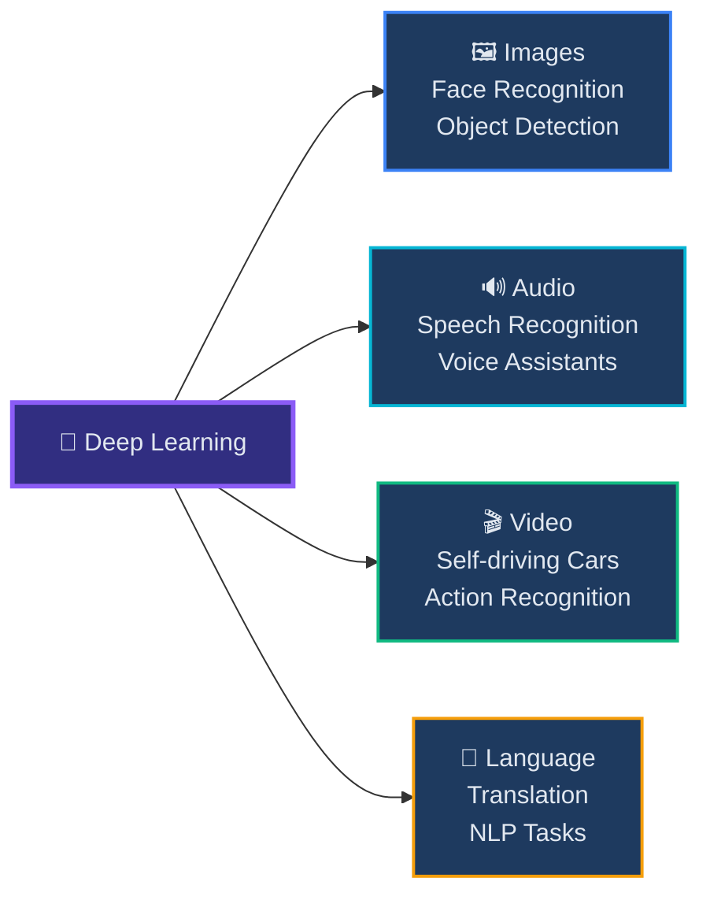

---

### 🟡 Generative AI

> Generative AI **creates NEW content** — it doesn't just analyze, it generates!

> **👨‍🏫 BUILD TO "AHA!" MOMENT:**  
> **Ask these questions sequentially:**
> 1. "Can traditional ML generate a poem from scratch?" (No)
> 2. "Can it create an image of a flying purple elephant?" (No)
> 3. "Can it write code for a new feature?" (No)
> 
> **Then deliver:**  
> "Generative AI can do ALL of these. It doesn't just analyze or predict... it CREATES!"

#### 🛠️ Generative AI Tools

| Tool | Purpose | Category |
|---|---|---|
| 💬 **ChatGPT** | Text generation, Q&A | Language |
| 💻 **GitHub Copilot** | Code generation | Code |
| 🎨 **Midjourney** | Image generation | Visual |
| 🎵 **Suno** | Music generation | Audio |
| 🎬 **Runway** | Video generation | Video |

> **👨‍🏫 THE GOLDEN QUESTION:**  
> **Ask:** "When you ask ChatGPT to 'Write a resignation email', does it search through a database of resignation emails?"  
> Let students think...  
> **Answer:** "NO! It GENERATES new content, word by word. Every response is created fresh."  
> 
> **This is the "Aha!" moment.**

> **👨‍🏫 TIME CHECK:** You should be ~35 mins into session

---

## 3. 🔄 Traditional AI vs Generative AI — Process Flows

> **👨‍🏫 TEACHING GOAL:**  
> Make the distinction crystal clear through visual comparison.  
> **Time:** 10 mins

### ⚡ Critical Difference: Traditional AI vs Generative AI

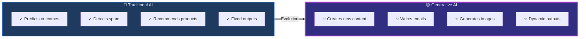

| Capability | Traditional AI | Generative AI |
|---|---|---|
| **Core Action** | Predicts | ✨ Creates |
| **Email** | Detects spam | ✨ Writes emails |
| **Commerce** | Recommends products | ✨ Generates ad images |
| **Output Type** | Fixed outputs | ✨ Dynamic outputs |

> **👨‍🏫 RAPID-FIRE QUIZ:**  
> Make this interactive! Ask quickly:
> 1. "Instagram recommendations?" → Traditional AI
> 2. "ChatGPT writing story?" → Generative AI
> 3. "Spam filter?" → Traditional AI
> 4. "DALL-E creating image?" → Generative AI
> 5. "Fraud detection?" → Traditional AI

---

### 🔵 Traditional AI Flow

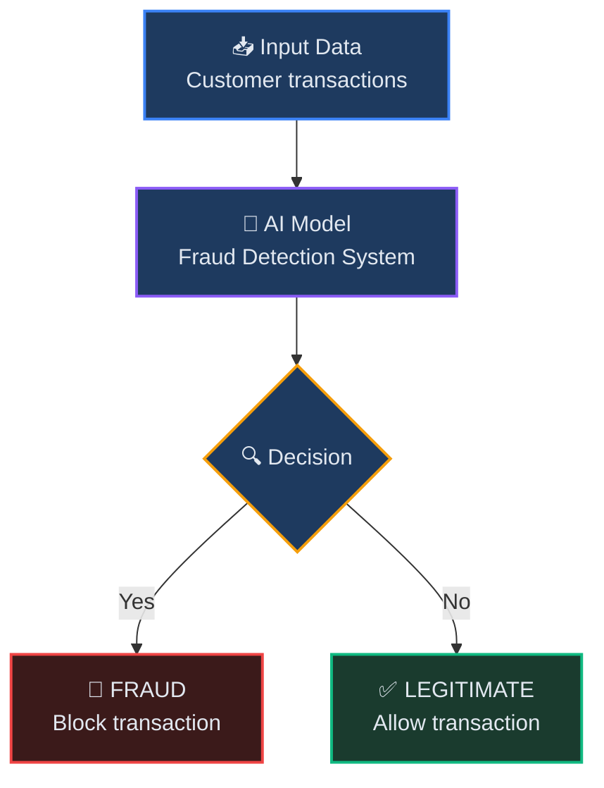

> **👨‍🏫 EXPLAIN:** "Traditional AI takes input, processes it, gives a classification/prediction. Fixed, predictable outputs."

---

### 🟡 Generative AI Flow

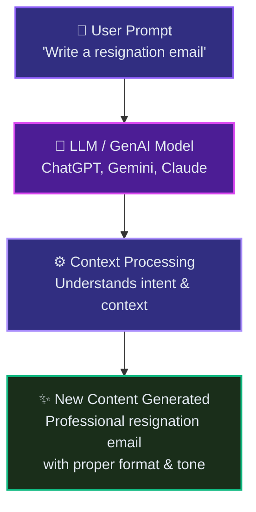

> **👨‍🏫 EXPLAIN:** "GenAI takes a prompt, understands context, CREATES new content dynamically. Every output can be unique."

---

### 🆚 Side-by-Side Comparison

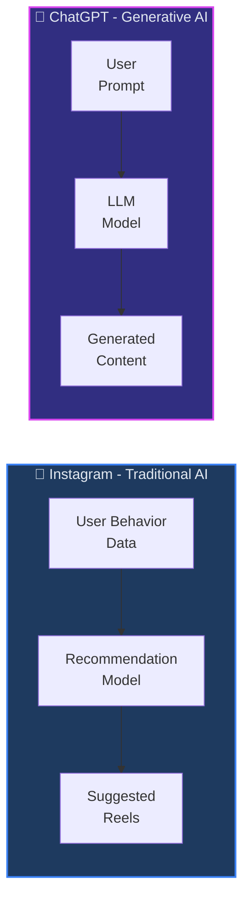

> **👨‍🏫 TIME CHECK:** You should be ~45 mins into session

---

## 4. 🌍 Why Generative AI Became So Popular

> **👨‍🏫 TEACHING NOTE:**  
> This section explains the paradigm shift. Keep it brief but impactful.  
> **Time:** 5 mins

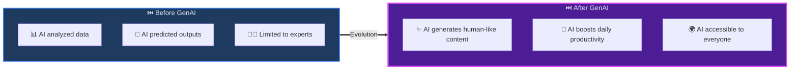

> **👨‍🏫 KEY STATEMENTS:**  
> "Before ChatGPT, AI was a tool FOR experts."  
> "After ChatGPT, AI became a tool FOR everyone."  
> 
> **Industry fact:**  
> "Developers using AI are replacing developers NOT using AI."

> 💡 **Industry Statement:**
> *"Developers using AI are becoming more productive than developers not using AI."*

> **👨‍🏫 QUICK STATS:**  
> - ChatGPT reached 100M users in 2 months (fastest ever)
> - Every major tech company has GenAI products now
> - New jobs created: Prompt Engineers, RAG Engineers, GenAI Developers

> **👨‍🏫 TIME CHECK:** You should be ~50 mins into session

---

## 5. 🏭 Real-World Applications of Generative AI

> **👨‍🏫 MAKE THIS HIGHLY INTERACTIVE:**  
> Don't just list - make STUDENTS name applications!  
> Ask: "Can someone give a GenAI application in SOFTWARE ENGINEERING?"  
> Then you add more examples.  
> **Time:** 10 mins

```mermaid
graph TD
    Root["✨ Generative AI<br/>Applications"]
    
    SE["💻 Software<br/>Engineering"]
    HC["🏥 Healthcare"]
    BK["🏦 Banking"]
    ED["🎓 Education"]
    MK["📣 Marketing"]
    
    SE1["AI Code Generation"]
    SE2["AI Debugging"]
    SE3["AI Documentation"]
    
    HC1["Medical Report<br/>Summarization"]
    HC2["Drug Discovery"]
    HC3["AI Doctor<br/>Assistants"]
    
    BK1["AI Customer<br/>Support"]
    BK2["Fraud Analysis"]
    BK3["Document<br/>Summarization"]
    
    ED1["AI Tutors"]
    ED2["Notes Generation"]
    ED3["Personalized<br/>Learning"]
    
    MK1["Ad Copy<br/>Generation"]
    MK2["SEO Content"]
    MK3["Social Media<br/>Content"]
    
    Root --> SE
    Root --> HC
    Root --> BK
    Root --> ED
    Root --> MK
    
    SE --> SE1
    SE --> SE2
    SE --> SE3
    
    HC --> HC1
    HC --> HC2
    HC --> HC3
    
    BK --> BK1
    BK --> BK2
    BK --> BK3
    
    ED --> ED1
    ED --> ED2
    ED --> ED3
    
    MK --> MK1
    MK --> MK2
    MK --> MK3
    
    style Root fill:#4c1d95,stroke:#d946ef,color:#e2e8f0,stroke-width:4px
    style SE fill:#312e81,stroke:#8b5cf6,color:#e2e8f0,stroke-width:2px
    style HC fill:#312e81,stroke:#10b981,color:#e2e8f0,stroke-width:2px
    style BK fill:#312e81,stroke:#3b82f6,color:#e2e8f0,stroke-width:2px
    style ED fill:#312e81,stroke:#f59e0b,color:#e2e8f0,stroke-width:2px
    style MK fill:#312e81,stroke:#ec4899,color:#e2e8f0,stroke-width:2px
```

| Industry | Applications |
|---|---|
| 💻 **Software Engineering** | Code generation, Debugging, Documentation |
| 🏥 **Healthcare** | Medical summarization, Drug discovery, AI assistants |
| 🏦 **Banking** | Customer support, Fraud analysis, Document summary |
| 🎓 **Education** | AI tutors, Notes generation, Personalized learning |
| 📣 **Marketing** | Ad copy, SEO content, Social media posts |

> **👨‍🏫 CAREER MOTIVATION:**  
> After going through applications, deliver:  
> "GenAI is NOT replacing developers. Developers using AI are replacing developers NOT using AI. That's why you're here - to be on the RIGHT side of this change."

> **👨‍🏫 TIME CHECK:** You should be ~1 hour into session

---

## 6. ⚙️ How ChatGPT Works (High-Level)

> **👨‍🏫 CRITICAL SECTION:**  
> **DO NOT** go into transformers/attention deeply.  
> Focus on INTUITION, not math.  
> **Time:** 15 mins

### 🏗️ ChatGPT Architecture Flow

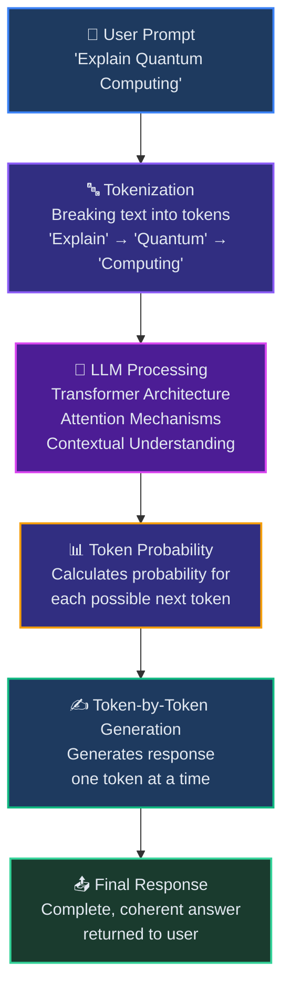

> **👨‍🏫 TEACHING APPROACH:**  
> Walk through the flow simply:
> 1. "You type a prompt"
> 2. "It breaks into pieces (tokens)"
> 3. "LLM processes and understands context"
> 4. "Calculates probability for next word"
> 5. "Generates one token at a time"
> 6. "Gives you the complete response"

---

### 📚 Step 1 — Training on Large Data

ChatGPT is trained using **massive amounts of text data**:

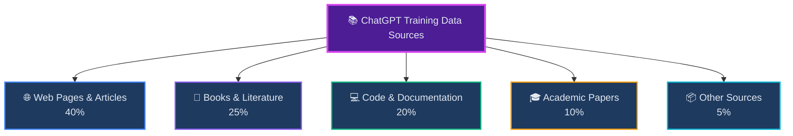

> **👨‍🏫 ANALOGY:**  
> "Imagine you read every book in 1000 libraries, every website, every code repository... ChatGPT's training is like that, but even BIGGER."

---

### 🔮 Step 2 — Learning Language Patterns

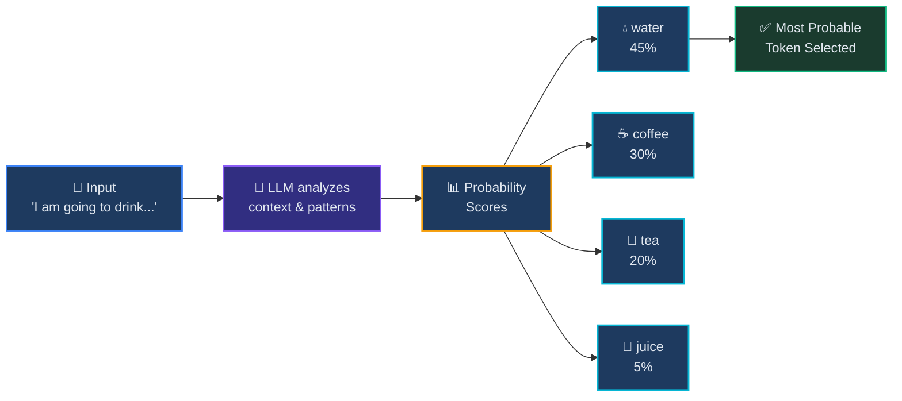

> **👨‍🏫 INTERACTIVE DEMO:**  
> Write on board: "I am going to drink..."  
> Ask: "What words might come next?"  
> Students say: water, tea, coffee, juice  
> **Then explain:** "Exactly! ChatGPT learned these probabilities from billions of examples."

> 🔑 **Key Insight:**
> *Large Language Models (LLMs) are advanced **next-word prediction** systems.*

> **👨‍🏫 THE GOLDEN DEFINITION:**  
> Write this BIG on the board:  
> **"LLMs are advanced NEXT-WORD PREDICTION systems."**  
> This is GOLD. Repeat it.

---

### 🎯 Step 3 — Token Prediction Example

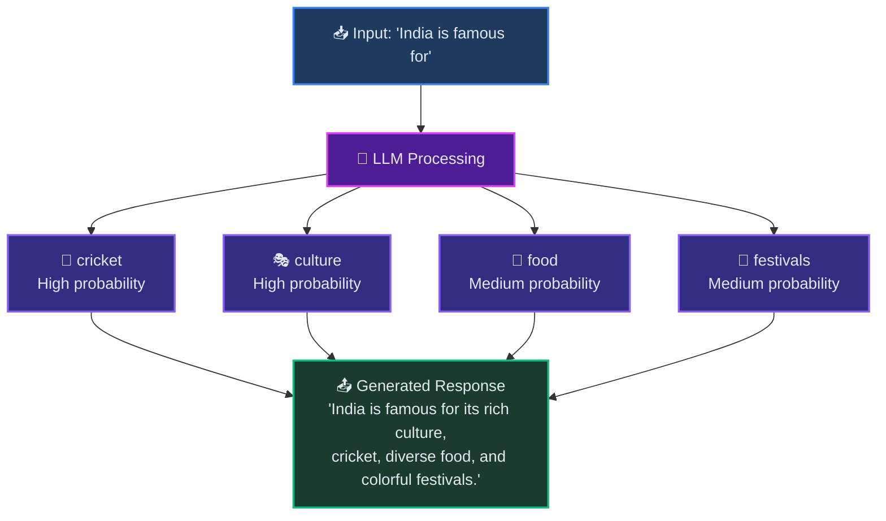

> ⚠️ **Important Clarification:**
> *ChatGPT does **NOT** think like humans.*
> *It **predicts patterns intelligently** using training data.*

> **👨‍🏫 CRITICAL CLARIFICATION:**  
> Emphasize STRONGLY:  
> "ChatGPT does NOT think like humans. It does NOT understand like humans. It does NOT have consciousness. What it DOES: It predicts patterns EXTREMELY well. It's prediction, not understanding. But the predictions are SO good, they SEEM intelligent."

> **👨‍🏫 UNDERSTANDING CHECK:**  
> Ask:
> - "Does ChatGPT have a database of answers?" (No)
> - "Is it thinking like humans?" (No)
> - "How does it work?" (Predicts next token based on probability)

> **👨‍🏫 TIME CHECK:** You should be ~1 hour 15 mins into session

---

## 7. 📈 Industry Evolution & Demand

> **👨‍🏫 GOAL:**  
> Motivate students about career opportunities.  
> **Time:** 10 mins

### 🚀 Technology Era Evolution

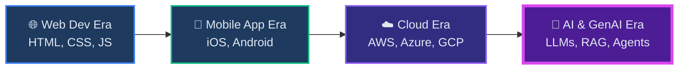

> **👨‍🏫 PERSPECTIVE:**  
> "Just like mobile development was THE skill 10 years ago, GenAI and AI Agents are THE skills NOW."

### 💼 High-Demand AI Roles

```mermaid
graph TD
    Market["🚀 AI Job Market<br/>High-Demand Roles"]
    
    R1["🤖 AI Engineer"]
    R2["✨ GenAI Engineer"]
    R3["📚 RAG Engineer"]
    R4["📱 AI App Developer"]
    R5["🔄 Agentic AI Engineer"]
    
    R1A["Build AI-powered apps"]
    R1B["LLM integration"]
    
    R2A["Prompt engineering"]
    R2B["Model fine-tuning"]
    
    R3A["Vector databases"]
    R3B["Retrieval systems"]
    
    R4A["End-to-end AI apps"]
    R4B["APIs & deployment"]
    
    R5A["Multi-agent systems"]
    R5B["AutoGen & LangGraph"]
    
    Market --> R1
    Market --> R2
    Market --> R3
    Market --> R4
    Market --> R5
    
    R1 --> R1A
    R1 --> R1B
    
    R2 --> R2A
    R2 --> R2B
    
    R3 --> R3A
    R3 --> R3B
    
    R4 --> R4A
    R4 --> R4B
    
    R5 --> R5A
    R5 --> R5B
    
    style Market fill:#4c1d95,stroke:#d946ef,color:#e2e8f0,stroke-width:4px
    style R1 fill:#312e81,stroke:#8b5cf6,color:#e2e8f0,stroke-width:2px
    style R2 fill:#312e81,stroke:#d946ef,color:#e2e8f0,stroke-width:2px
    style R3 fill:#312e81,stroke:#3b82f6,color:#e2e8f0,stroke-width:2px
    style R4 fill:#312e81,stroke:#10b981,color:#e2e8f0,stroke-width:2px
    style R5 fill:#312e81,stroke:#f59e0b,color:#e2e8f0,stroke-width:2px
```

> **👨‍🏫 SALARY CONTEXT (India, 2026):**  
> - AI Engineer: ₹15-35 LPA
> - GenAI Engineer: ₹18-40 LPA
> - RAG Engineer: ₹20-45 LPA
> - Agentic AI Engineer: ₹25-50 LPA
> 
> **Say:** "These are current market rates. High demand, good pay."

> **👨‍🏫 TIME CHECK:** You should be ~1 hour 25 mins into session

---

## 8. 🔍 Introduction to RAG — Preview

> **👨‍🏫 SETUP FOR FUTURE SESSIONS:**  
> Create curiosity for Week 2 content.  
> **Time:** 5 mins

### 📡 Basic RAG Architecture

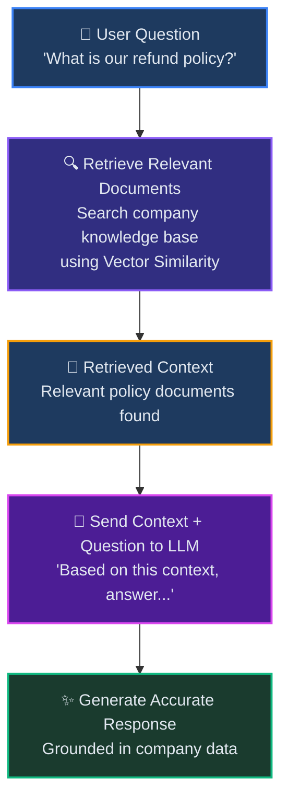

> **👨‍🏫 START WITH QUESTION:**  
> "Can companies train their own ChatGPT from scratch?"  
> Let students think...  
> **Answer:** "Theoretically yes, but costs MILLIONS of dollars and months of time."  
> **Then ask:** "So what do most companies do instead?"

> 💡 **Why RAG?**
> Companies usually cannot train their own ChatGPT models from scratch.
> Instead, they **connect company data to existing LLMs**.
> This concept is called **RAG (Retrieval Augmented Generation)**.
> → *Will be covered in depth in upcoming sessions.*

> **👨‍🏫 CONCRETE EXAMPLE:**  
> "Imagine you work at a company with:
> - 1000 policy documents
> - Employee handbooks
> - Internal procedures
> 
> Instead of employees reading everything:
> - They ask: 'What's our refund policy?'
> - RAG finds relevant policy docs
> - Sends to LLM with question
> - LLM generates accurate answer based on YOUR company's policy
> 
> Not generic internet knowledge - YOUR specific data!"

> **👨‍🏫 BUILD ANTICIPATION:**  
> "In Week 2, we will BUILD our own RAG system. You'll use vector databases, connect documents to LLMs, and create AI chatbots. By the end, you'll have a project you can showcase to employers!"

> **👨‍🏫 THE HOOK:**  
> "The companies using RAG are NOT asking 'Should we use AI?' They're asking 'How fast can we deploy it?' And they need people like YOU who know how to build these systems."

> **👨‍🏫 TIME CHECK:** You should be ~1 hour 30 mins into session

---

## ❓ Quick Revision Questions

> **👨‍🏫 QUICK ACTIVITY:**  
> Rapid fire - students answer out loud.  
> **Time:** 5 mins

| # | Question |
|---|---|
| 1️⃣ | What is Artificial Intelligence? |
| 2️⃣ | Difference between ML and Generative AI? |
| 3️⃣ | Why is ChatGPT called Generative AI? |
| 4️⃣ | Give one real-world application of GenAI. |
| 5️⃣ | What is the basic idea behind LLMs? |

> **👨‍🏫 EXPECTED ANSWERS:**
> 1. Machines mimicking human intelligence
> 2. ML predicts/classifies, GenAI creates new content
> 3. It generates new text, doesn't retrieve from database
> 4. (Any valid example from class)
> 5. Advanced next-word prediction systems

---

## 🏠 Homework

> **👨‍🏫 ASSIGNMENT DELIVERY:**  
> Make this clear and write on board.  
> **Time:** 2 mins

### Explore & Compare these AI Tools

| Tool | Website |
|---|---|
| 💬 **ChatGPT** | chat.openai.com |
| 🌟 **Google Gemini** | gemini.google.com |
| 🧠 **Claude AI** | claude.ai |

### Compare Across These Dimensions

- [ ] 📖 **Response Quality** — Which gives more accurate answers?
- [ ] 🎨 **Creativity** — Which generates more creative content?
- [ ] 💻 **Coding Capability** — Which writes better code?
- [ ] ⚡ **Speed** — Which responds fastest?

> **👨‍🏫 GIVE THEM A PROMPT TO TRY:**  
> "Try this on all three:  
> 'Explain quantum computing to a 10-year-old child'  
> 
> Notice:
> - Which explanation is clearest?
> - Which uses best analogies?
> - Which is most engaging?
> 
> Bring your observations to Day 2!"

> **👨‍🏫 WHY THIS HOMEWORK WORKS:**  
> - Hands-on exploration
> - Comparative thinking
> - Prepares for prompt engineering (Day 2)
> - Gets them using the tools actively

---

## 🔭 Next Class Preview

### 📅 Day 2 — Tokens and Tokenization

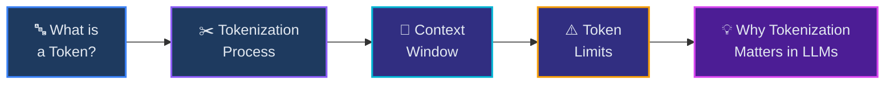

> **👨‍🏫 CLOSING STATEMENT:**  
> **Deliver with energy:**
> 
> "Congratulations! You've just completed your first step into Generative AI.  
>   
> Today you learned:
> - ✅ What AI, ML, DL, and GenAI are
> - ✅ Difference between Traditional AI and Generative AI
> - ✅ Why GenAI became revolutionary
> - ✅ Real-world applications across industries
> - ✅ How ChatGPT works (high level)
> - ✅ Career opportunities in AI
> - ✅ What RAG is and why it matters
>   
> Next class, we'll dive into:
> - 🔤 Tokens and Tokenization
> - 📏 Context windows and token limits
> - 💡 Why this matters for LLMs
> - ⚙️ How tokens affect cost and performance
>   
> Remember: You're not just learning to USE AI.  
> You're learning to BUILD with AI.  
>   
> See you in Day 2! Keep exploring!"

> 🎉 **Great work completing Day 1!** See you in the next session.

---

📊 <b>POST-SESSION CHECKLIST - Click to Expand</b>

### After Class, Verify:

- [ ] All students understood AI → ML → DL → GenAI hierarchy
- [ ] Students can differentiate Traditional vs Generative AI
- [ ] Students understand why GenAI became revolutionary
- [ ] Students can name 3+ real-world GenAI applications
- [ ] Students understand ChatGPT works via token prediction
- [ ] Students know about RAG at a high level
- [ ] Homework assignment is clear (compare ChatGPT, Gemini, Claude)
- [ ] Students know when/where next class is
- [ ] You noted which concepts need review
- [ ] You identified students who need extra help

### Sentiment You Want:

> "GenAI is actually understandable."  
> "I now get what ChatGPT basically does."  
> "I'm excited for RAG and AI agents."  
> "This course is going to be useful for my career."

### What Worked Well:
- 
- 
- 

### What to Improve Next Time:
- 
- 
- 

---

*📅 Last Updated: May 2026 | Course: Generative AI Fundamentals*

---

## 📚 Quick Reference for Teachers

| If This Happens... | Do This... |
|-------------------|------------|
| **Students look confused** | Pause, ask "What's unclear?", use different analogy |
| **Students disengaged** | Ask direct question, start activity, share industry story |
| **Running out of time** | Prioritize: ML vs GenAI, Traditional vs GenAI, How ChatGPT works |
| **Ahead of schedule** | More Q&A, live demo of tools, discuss student project ideas |
| **Technical question beyond scope** | "Great question! That's advanced - let's discuss after class" |

**Remember:** Your enthusiasm is contagious. If you're excited about GenAI, students will be too! 🚀
